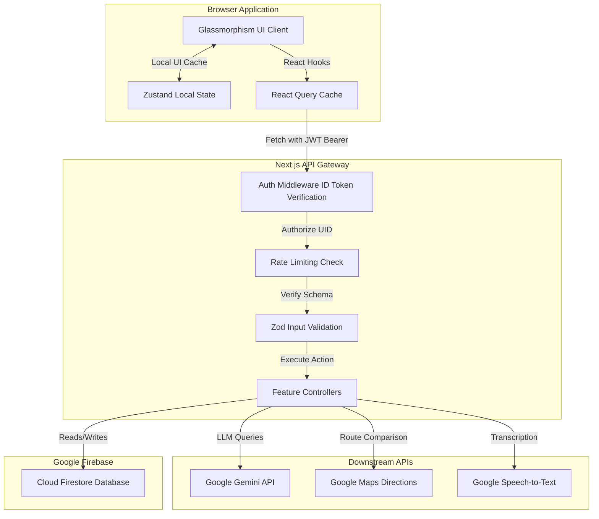

# 🌲 Rootly AI — Intelligent Carbon Footprint Coach & Compliance Platform

> **Hackathon Submission** // *A Premium, AI-Driven Carbon Awareness Experience*
>
> Built with Next.js 15 (App Router), TypeScript, Firebase Firestore, Google Cloud APIs, and Google Gemini 3.5 Flash models.

---

## 💡 1. Problem Statement

Most carbon trackers fail because they are passive calculators. They require users to manually input dozens of granular daily metrics, show generic carbon metrics (e.g. "your footprint is 4.2 tons"), and offer generic tips like "turn off your lights." This leads to:
- **High Friction**: Manual logging fatigue causes users to abandon tracking.
- **No Actionability**: Flat data displays do not tell users *how* or *where* to start reducing emissions in their daily lives.
- **Privacy Gaps**: Users are reluctant to share locations, voice transcripts, or daily behavior details with tracking systems.

---

## 🚀 2. Solution Overview

**Rootly AI** shifts carbon tracking from a passive spreadsheet to an active, context-aware partnership. 

It functions as an **Environmental Intelligence Coach** that:
- **Reduces Logging Friction**: Uses advanced Voice Logging to parse natural speech (e.g. *"I rode a bus for 15km and had a vegan lunch"*), extracting and calculating emissions automatically.
- **Contextual AI Coaching**: Google Gemini 3.5 Flash analyzes your historical activity log, active goals, and carbon score, acting as an interactive coach that responds to questions with custom, quantified advice.
- **Action-Oriented Maps**: Integrates Google Maps Directions to show side-by-side transit options, automatically calculating carbon savings relative to driving.
- **Certified Disclosures**: A server-side Export System logs export history in Firestore and dynamically compiles CSV disclosures, print-ready PDF briefs, and Google Sheets integrations suitable for ISO 14064 compliance.
- **Privacy First**: Uses salted SHA-256 UID hashing for analytics and sanitizes all telemetry logs before storage.

---

## 🏗️ 3. Architecture & Data Flow

Rootly utilizes a feature-based Next.js 15 App Router architecture. Data fetching is cached and managed via React Query, state is managed in Zustand, and security boundaries are enforced in Next.js API Routes and Firestore Security Rules.

### System Diagram



---

## ✨ 4. Core Features & AI Capabilities

### 🎤 A. AI-Driven Voice Logging (`/voice`)
- **Speech-to-Text**: MediaRecorder records WebM/Opus audio, which Google Speech-to-Text transcribes.
- **Semantic Extraction**: Gemini parses the transcript, extracting categories (`transport`, `food`, etc.), activities, and quantities.
- **Calculation**: Standard conversion factors are applied to the extracted items, presenting a preview card to the user for one-click logging.

### 🗺️ B. Transit Route Comparison (`/routes`)
- **Directions API**: Fetches route distance, duration, and transit parameters from Google Maps.
- **Footprint Delta**: Compares emissions across Walking, Cycling, EV Car, Petrol Car, Bus, and Train.
- **Reasoning**: Gemini provides a short summary explaining the optimal mode of transit based on travel time and carbon savings.

### 📊 C. Weekly AI briefings (`/reports`)
- **Ops Report**: Compiles the last 7 days of activities and compares them with the previous week.
- **Narrative & Goals**: Gemini 3.5 Flash generates a narrative briefing explaining performance trends, changes in carbon scores, and suggests 3 actionable, prioritized goals (High/Medium/Low priority).

### 📤 D. Server-Side Export System (`/exports`)
- **Formulation**: Compiles CSV logs, PDF formatted disclosures, and Google Sheets links on the server.
- **Traceability**: All export actions are logged in Firestore (`exports_history` collection) to maintain audit trails.

---

## 🔒 5. Firebase & Firestore Integration

Rootly is built to scale on **Firebase Firestore**. Data is structured to isolate user sessions and enforce data privacy.

### Firestore Collections Model

```
├── users/ (User Profiles)
│   └── {uid} -> { carbonScore, weeklyGoalKg, totalEmissionsKg }
│
├── activities/ (Granular footprint logs)
│   └── {activityId} -> { userId, category, emission, quantity, timestamp }
│
├── goals/ (Missions & objectives)
│   └── {goalId} -> { userId, title, targetReductionKg, status }
│
├── weeklyReports/ (AI generated narrative summaries)
│   └── {reportId} -> { userId, totalEmissionsKg, narrative, generatedAt }
│
├── exports_history/ (Exports audit logs)
│   └── {exportId} -> { userId, format, contentType, status, downloadUrl }
│
└── analytics_daily/ (Telemetry counters)
    └── {YYYY-MM-DD} -> { counts: { CHAT_USAGE: 48 }, uniqueUsers: [...] }
```

### Firestore Security Rules
All database access is secured by client-enforced authorization rules:
- **Read/Write Security**: `allow read, write: if request.auth.uid == resource.data.userId;`
- **Immutability Check**: `activities` and `weeklyReports` are configured with `allow update: if false;` to maintain audit trail integrity.

---

## ⚙️ 6. Setup & Configuration

### Prerequisites
- **Node.js**: `v18.17` or higher
- **Firebase CLI**: `npm install -g firebase-tools`
- **Accounts**: Anthropic Console (API Key), Google Cloud Platform (Maps Directions & Speech APIs enabled)

### Step-by-Step Installation

1. **Clone the repository**:
   ```bash
   git clone <repo-url>
   cd Rootly
   ```

2. **Install dependencies**:
   ```bash
   npm install
   ```

3. **Configure Environment Variables**:
   Copy `.env.example` to `.env.local`:
   ```bash
   cp .env.example .env.local
   ```
   Fill in `.env.local` using the reference table below:

   | Environment Variable | Scope | Description |
   |---|---|---|
   | `NEXT_PUBLIC_FIREBASE_API_KEY` | Client & Server | Web SDK Public Key |
   | `NEXT_PUBLIC_FIREBASE_PROJECT_ID` | Client & Server | Firebase Project ID |
   | `FIREBASE_ADMIN_PROJECT_ID` | Server Only | Service Account Project ID |
   | `FIREBASE_ADMIN_PRIVATE_KEY` | Server Only | Private key wrapped in double quotes |
   | `ANTHROPIC_API_KEY` | Server Only | Anthropic API Key |
   | `GOOGLE_MAPS_API_KEY` | Server Only | Google Cloud API Key |

4. **Deploy Rules and Indexes**:
   ```bash
   # Select your active Firebase project
   npx firebase-tools use your-project-id
   # Deploy rules & indexes
   npx firebase-tools deploy --only firestore
   ```

5. **Start Dev Server**:
   ```bash
   npm run dev
   ```
   Open [http://localhost:3000](http://localhost:3000) to begin the mission.

---

## 🧪 7. Testing & Verification

Rootly maintains a robust test suite powered by **Vitest** and **Mock Service Worker (MSW)**.

```bash
# Run all tests (Unit, Integration, and API validation)
npm run test

# Launch visual interactive vitest test suite UI
npm run test:ui

# Generate code coverage reports
npm run test:coverage
```

- **API Interception**: MSW mocks external API responses (Gemini and Google Maps Directions) to allow testing routes offline.
- **Throttling Verification**: Integration tests verify that sending more than 5 export requests or 20 chat messages sequentially triggers `429 Too Many Requests`.

---

## 🚀 8. Future Roadmap

- [ ] **Redis Rate Limiting**: Move from in-memory Next.js route caching to a Redis-backed token bucket (e.g. Upstash) to support serverless auto-scaling.
- [ ] **OAuth Google Sheets**: Upgrade Sheets sync from mock configurations to a full OAuth2 user-linked sync.
- [ ] **Native Mobile Shell**: Wrap the client in a React Native / Capacitor shell to leverage native mobile microphone APIs.
- [ ] **ISO Certification**: Partner with carbon accounting auditors to provide automatic ISO 14064 audit certifications for corporate export profiles.

---

## 👥 9. Contributors

- **Staff Engineer / Technical Writer**: Antigravity AI
- **UI Designer**: Stitch Design Engine
